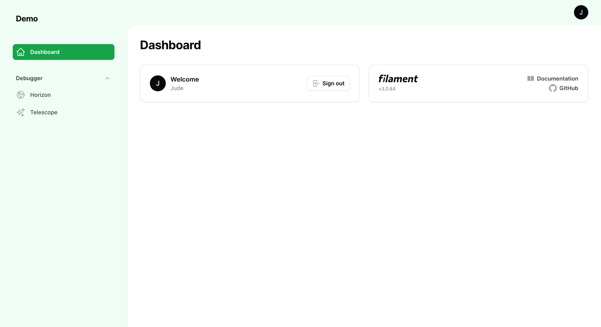

# Filament Debugger

[](https://packagist.org/packages/stephenjude/filament-debugger)
[](https://github.com/stephenjude/filament-debugger/actions?query=workflow%3Arun-tests+branch%3Amain)
[](https://github.com/stephenjude/filament-debugger/actions?query=workflow%3A"Fix+PHP+code+style+issues"+branch%3Amain)
[](https://packagist.org/packages/stephenjude/filament-debugger)

Easily add Laravel Telescope and Horizon to Filament admin panel.



## Installation

You can install the package via composer:

```bash
composer require stephenjude/filament-debugger
```

Run the setup command using

```bash
php artisan filament-debugger:install
```

This is the contents of the published config file:

```php
return [
    'debuggers' => [
        'horizon',
        'telescope'
    ],

    'authorization' => false,

    'permissions' => [
        'horizon' => 'horizon.view',
        'telescope' => 'telescope.view',
    ],
];

```

Add the plugin to your panel plugins array

```php
$panel
    ->plugins([
        DebuggerPlugin::make(),
    ]);
```


## Debuggers
This package comes with first party Laravel packages for development and monitoring your Laravel application.

### Laravel Telescope
Telescope provides insight into the requests coming into your application, exceptions, log entries, database queries, queued jobs, mail, notifications, cache operations, scheduled tasks, variable dumps, and more. [Documentation](https://laravel.com/docs/9.x/telescope).

### Laravel Horizon
Horizon allows you to easily monitor key metrics of your queue system such as job throughput, runtime, and job failures. [Documentation](https://laravel.com/docs/9.x/horizon).
## Usage
Now you can view the installed debuggers when you log in into your filament admin panel.


## Gates & Authorization 
When using filament debuggers (Horizon & Telescope) in production environment, we need to make sure that they are accessible to the authorized filament admin user. 

To achive this, we need to use filament default authorization guard and the permissions provided in this package by overidding the `gate()` and  `authorization()` methods inside the HorizonServiceProvider and TelescopeServiceProvider respectively.

### Navigation Access
We need to set authorization to `true` inside the filament debugger config if we want to make it visible to only users with correct access in the admin panel navigation.

### Update HorizonServiceProvider.php
```php
protected function gate()
{
    Gate::define('viewHorizon', function ($user) {
        return $user->can(config('filament-debugger.permissions.horizon'));
    });
}

protected function authorization()
{
    Auth::setDefaultDriver(config('filament.auth.guard'));

    parent::authorization();
}

```

### Update TelescopeServiceProvider.php
```php
protected function gate()
{
    Gate::define('viewTelescope', function ($user) {
        return $user->can(config('filament-debugger.permissions.telescope'));
    });
}

protected function authorization()
{
    Auth::setDefaultDriver(config('filament.auth.guard'));

    parent::authorization();
}

```

## Creating Permissions
To make use of the permissions configured in this package we need a permission package like [Laravel Permissions](https://github.com/spatie/laravel-permission) or [Bouncer](https://github.com/JosephSilber/bouncer) which usually comes with the `Permission` Model. USe what works for you.

The permissions we need to create is already defined inside the filament debugger config file.

Here is an example using the Spatie Permission Package:

```php
use Spatie\Permission\Models\Permission;

collect(config('filament-debugger.permissions'))
    ->map(fn($permission) => Permission::firstOrCreate([
        'name' => $permission,
        'guard_name' => config('filament.auth.guard'),
    ]));
```
You can also use your already created permission by updating the permission configuration:
```php
'permissions' => [
    'horizon' => 'your horizon permission name',
    'telescope' => 'your telescope permission name',
],
```

####  Screenshots:


## Testing

```bash
composer test
```

## Changelog

Please see [CHANGELOG](CHANGELOG.md) for more information on what has changed recently.

## Contributing

Please see [CONTRIBUTING](https://github.com/stephenjude/.github/blob/main/CONTRIBUTING.md) for details.

## Security Vulnerabilities

Please review [our security policy](../../security/policy) on how to report security vulnerabilities.

## Credits

- [stephenjude](https://github.com/stephenjude)
- [All Contributors](../../contributors)

## License

The MIT License (MIT). Please see [License File](LICENSE.md) for more information.
